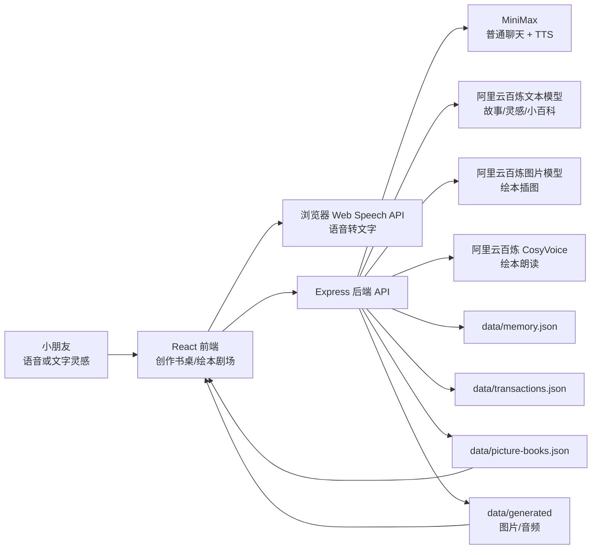
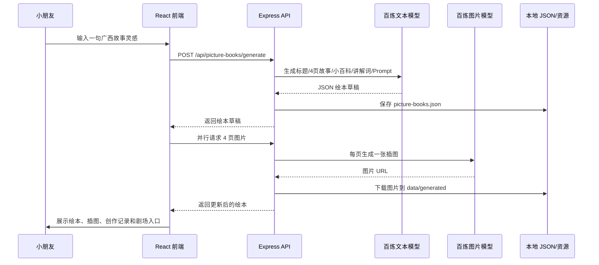

# 当前项目软件架构与技术模型

## 项目概览

项目名称：小圆 AI 陪伴机器人 / 桂韵创想家

当前项目是一个本地运行的 Web 应用，核心目标是让小学生通过一句话灵感，创作广西非遗文旅 AI 绘本。项目同时保留“小圆 AI 陪伴机器人”的语音聊天、长期记忆和 transaction 对话记录能力。

## 技术栈

| 层级 | 技术 | 作用 |
|---|---|---|
| 前端框架 | React 19 + TypeScript | 构建创作书桌、绘本展示、绘本剧场和交互状态 |
| 构建工具 | Vite 7 | 本地开发服务器、前端构建、API 代理 |
| UI 图标 | lucide-react | 麦克风、朗读、书本、删除、进度等图标 |
| 后端框架 | Express 5 + TypeScript | 提供 AI 调用、数据保存、图片/音频资源服务 |
| 运行工具 | tsx + concurrently | 同时运行 Vite 前端和 Express 后端 |
| 本地存储 | JSON 文件 | 保存记忆、transaction、绘本作品、生成资源 |
| 普通聊天模型 | MiniMax OpenAI 兼容接口 | 小圆陪伴式聊天 |
| 普通 TTS | MiniMax `t2a_v2` | 聊天回复语音合成 |
| 绘本文本模型 | 阿里云百炼 DashScope 兼容 OpenAI 接口 | 生成故事、文化小百科、Prompt、灵感锦囊 |
| 绘本图片模型 | 阿里云百炼 `wan2.7-image-pro` | 生成 4 页绘本插图 |
| 绘本 TTS | 阿里云百炼 CosyVoice WebSocket | 生成绘本朗读音频并缓存 |
| 浏览器能力 | Web Speech API + SpeechSynthesis | 语音输入和浏览器语音兜底 |

## 目录结构

```text
.
├── src/
│   ├── App.tsx                  # 前端主应用：创作书桌、书架、绘本展示、绘本剧场
│   ├── main.tsx                 # React 入口
│   ├── styles.css               # 全局样式
│   ├── assets/companion-robot.png
│   └── types/                   # 浏览器语音和静态资源类型声明
├── server/
│   ├── index.ts                 # Express API 入口
│   ├── minimax.ts               # MiniMax 聊天与 TTS
│   ├── bailian.ts               # 百炼文本、灵感锦囊、图片生成
│   ├── bailianTts.ts            # 百炼 CosyVoice TTS
│   ├── bookStore.ts             # 绘本数据模型与保存
│   ├── memoryStore.ts           # 长期记忆提取与保存
│   ├── transactionStore.ts      # 对话 transaction 保存
│   └── guangxiFallback.ts       # 广西文化元素库与本地 fallback 绘本
├── data/
│   ├── memory.json              # 长期记忆
│   ├── transactions.json        # 聊天 transaction
│   ├── picture-books.json       # 绘本作品
│   └── generated/               # 生成图片、占位图、朗读音频
├── docs/
│   ├── guiyun-creative-requirements.md
│   ├── kid-ai-conversation-0-to-1.md
│   └── software-architecture.md
├── vite.config.ts               # Vite 配置和 API 代理
├── package.json
└── .env.example
```

## 总体架构



## 前端模块

前端集中在 `src/App.tsx`，它不是拆成很多页面，而是在一个应用里管理两种 route：

- `#/`：桂小灵绘本工坊，也就是创作书桌。
- `#/play/:bookId`：桂小灵绘本剧场，用于比赛现场逐页讲故事。

主要前端状态：

| 状态 | 含义 |
|---|---|
| `idea` | 当前小朋友输入的一句话灵感 |
| `books` | 左侧“我的绘本书架”摘要列表 |
| `activeBook` | 当前打开的完整绘本 |
| `bookLanguage` | 中文或英文绘本 |
| `protagonistGender` | 主角小朋友是女孩或男孩 |
| `shouldGenerateImage` | 是否一次生成 4 页插图 |
| `generationProgress` | 绘本生成阶段、计时、插图任务状态和公开草稿流 |
| `activeTab` | 当前显示绘本内容或创作记录 |

主要前端组件：

| 组件/函数 | 作用 |
|---|---|
| `App` | 工作台主界面、语音输入、绘本生成、书架管理 |
| `GenerationProgressPanel` | 展示生成进度、阶段、每页图片状态和过程日志 |
| `BookView` | 展示绘本标题、标签、问题、大纲、小百科、4 页故事和插图 |
| `PromptView` | 展示每本书的 Prompt 记录和输出 |
| `PictureBookPlayer` | 独立绘本剧场，支持逐页翻页、朗读全书、朗读单页 |
| `speakWithBrowser` | 优先播放服务端音频，失败时使用浏览器语音合成 |

## 后端 API

Express 服务运行在 `127.0.0.1:8787`，Vite 通过 `vite.config.ts` 把 `/api` 和 `/generated` 代理到后端。

| 方法 | 路径 | 作用 |
|---|---|---|
| `GET` | `/api/health` | 健康检查 |
| `GET` | `/api/bailian/status` | 查看百炼模型配置状态 |
| `POST` | `/api/speech` | 使用百炼 TTS 合成绘本语音 |
| `POST` | `/api/inspiration-chips` | 生成或 fallback 灵感锦囊 |
| `GET` | `/api/memory` | 读取长期记忆 |
| `POST` | `/api/memory/clear` | 清空长期记忆 |
| `GET` | `/api/transactions` | 获取聊天 transaction 列表 |
| `POST` | `/api/transactions` | 创建 transaction |
| `GET` | `/api/transactions/:id` | 获取某个 transaction |
| `DELETE` | `/api/transactions/:id` | 删除某个 transaction |
| `GET` | `/api/picture-books` | 获取绘本书架摘要 |
| `GET` | `/api/picture-books/:id` | 获取完整绘本 |
| `POST` | `/api/picture-books/generate` | 根据一句灵感生成绘本草稿，可选同时生成插图 |
| `POST` | `/api/picture-books/:id/speech/preload` | 预生成绘本每页朗读音频 |
| `POST` | `/api/picture-books/:id/pages/:pageNumber/image` | 重新生成单页插图 |
| `DELETE` | `/api/picture-books/:id` | 删除绘本 |
| `POST` | `/api/chat` | 小圆普通陪伴聊天，含记忆、transaction 和 TTS |

## 绘本生成流程



## AI 模型分工

### MiniMax

用于“小圆 AI 陪伴机器人”的普通聊天：

- 环境变量：`MINIMAX_API_KEY`
- 默认文本模型：`MiniMax-M2.7`
- 默认 TTS 模型：`speech-2.8-hd`
- 默认声音：`Chinese (Mandarin)_Warm_Girl`

对应文件：`server/minimax.ts`

### 阿里云百炼 / DashScope

用于“桂韵创想家”的主要多模态能力：

- 灵感锦囊：默认 `qwen-turbo`
- 绘本故事：默认 `deepseek-v4-pro`
- 通用文本配置：默认 `qwen3.7-max`
- 图片生成：默认 `wan2.7-image-pro`
- 图片尺寸：默认 `2K`
- 绘本朗读：默认 `cosyvoice-v3-flash`
- 女孩声音：默认 `longling_v3`
- 男孩声音：默认 `longjielidou_v3`

对应文件：

- `server/bailian.ts`
- `server/bailianTts.ts`

## 数据模型

### PictureBook

绘本作品保存在 `data/picture-books.json`，主要字段包括：

| 字段 | 含义 |
|---|---|
| `id` | 绘本 ID |
| `title` / `subtitle` | 标题和副标题 |
| `originalIdea` | 小朋友原始灵感 |
| `language` | `zh` 或 `en` |
| `protagonistGender` | `girl` 或 `boy` |
| `heritageElements` | 广西文化亮点 |
| `tourismElements` | 广西文旅元素 |
| `guidingQuestions` | 桂小灵的小问题 |
| `outline` | 故事路线 |
| `pages` | 4 页绘本页面 |
| `tourGuideScript` | 小小文旅推荐官讲解词 |
| `studentReflection` | 学生创作小记 |
| `aiContentRatio` | AI 内容占比 |
| `promptRecords` | 创作 Prompt 记录 |

### PictureBookPage

| 字段 | 含义 |
|---|---|
| `pageNumber` | 页码 |
| `title` | 单页标题 |
| `text` | 单页绘本正文 |
| `imagePrompt` | 单页图片 Prompt |
| `imageUrl` | 插图资源地址 |
| `imageSource` | `bailian` 或 `placeholder` |
| `cultureNote` | 单页文化小百科 |
| `speechAudioUrl` | 单页朗读音频地址 |
| `speechAudioText` | 音频对应文本 |

### MemoryFact

长期记忆保存在 `data/memory.json`：

- `id`
- `text`
- `createdAt`
- `lastMentionedAt`
- `source`

系统只保存简单安全事实，过滤手机号、住址、密码、身份证、银行卡等敏感信息。

### TransactionRecord

聊天记录保存在 `data/transactions.json`：

- `id`
- `title`
- `createdAt`
- `updatedAt`
- `messages`

每个 transaction 最多保留最近 80 条消息，列表最多保留 40 个 transaction。

## Fallback 与稳定性设计

为了适合比赛演示，项目做了多层兜底：

- 百炼 API key 缺失时，使用 `guangxiFallback.ts` 本地生成演示绘本。
- 百炼文本生成失败时，切换成本地 fallback 绘本。
- 百炼图片生成失败时，生成本地 SVG placeholder 插图。
- 百炼 TTS 失败时，前端使用浏览器 `speechSynthesis` 兜底朗读。
- 图片、音频下载到 `data/generated/`，前端通过 `/generated/...` 访问，减少外部 URL 失效风险。
- `bookStore.ts` 使用简单队列避免同时更新同一本绘本时写文件冲突。

## 安全与隐私

- API key 只放在后端 `.env` 中，不进入前端 bundle。
- 前端通过 `/api` 调用后端，不能直接看到模型 key。
- 长期记忆只提取儿童可接受的普通事实。
- 系统提示词要求不索要手机号、住址、密码、身份证、银行卡等隐私。
- 儿童安全场景会建议找家长、老师或可信任的大人。
- 图片 Prompt 明确禁止可读文字、水印、Logo、界面文字等，降低生成乱码和不合适内容的概率。

## 本地运行

安装依赖：

```bash
npm install
```

创建 `.env`，参考 `.env.example` 填入 MiniMax 和百炼 key。

启动开发环境：

```bash
npm run dev
```

访问：

```text
http://127.0.0.1:5173
```

构建：

```bash
npm run build
```

## 当前能力边界

当前版本适合单机本地演示，还不是多人在线系统：

- 没有用户登录。
- 没有数据库，使用本地 JSON 文件。
- 没有多人协作权限控制。
- 没有复杂后台管理系统。
- 没有视频生成。
- 没有硬件机器人接入。

## 后续可升级方向

- 接入数据库，支持多用户作品管理。
- 增加手动编辑绘本文字和 Prompt 的界面。
- 增加作品导出 PDF 或 PPT。
- 增加上传手绘图，再由 AI 改成绘本风格。
- 增加广西文化知识库检索，减少模型幻觉。
- 增加比赛演示模式，一键播放完整讲解流程。

